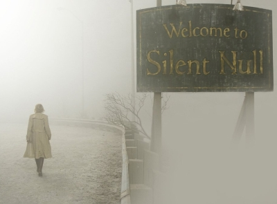

[![Code quality][s1]][co] [![License][s2]][li]

[s1]: https://api.codacy.com/project/badge/Grade/cfe234fc62b0403784d58edb91fcc815
[s2]: https://img.shields.io/badge/license-GPL%203.0-blue.svg

[co]: https://www.codacy.com/app/matt77hias/cpp-samples?utm_source=github.com&amp;utm_medium=referral&amp;utm_content=matt77hias/cpp-samples&amp;utm_campaign=Badge_Grade
[li]: https://raw.githubusercontent.com/matt77hias/cpp-samples/master/LICENSE.txt

# cpp-samples

> C++ has flaws, but what does that matter when it comes to matters of the heart? We love what we love. Reason does not enter into it. In many ways, unwise love is the truest love. Anyone can love a thing because. That’s as easy as putting a penny in your pocket. But to love something despite. To know the flaws and love them too. That is rare and pure and perfect.

<i>The Wise Programmer’s Fear</i>

## About
Samples for prototyping and experimenting with various C++ standards and features.

## Try It Online
* [Godbolt](https://godbolt.org/)
* [Wandbox](https://wandbox.org/)
